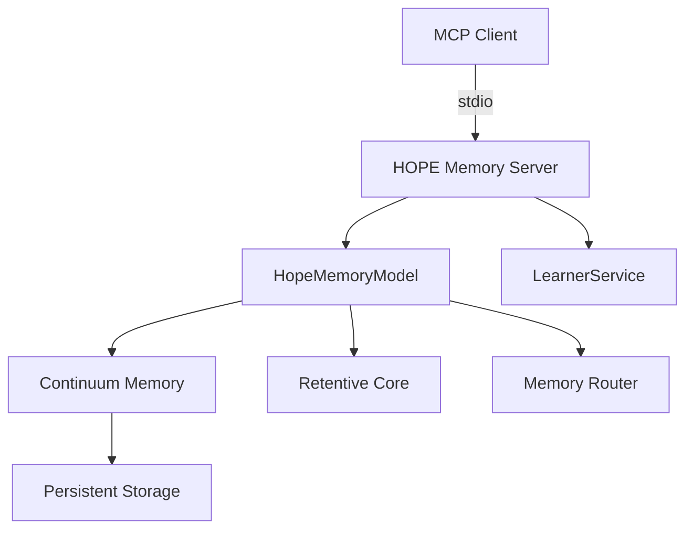

# MCP-Titan Documentation Index

Welcome to the MCP-Titan HOPE Memory Server documentation. This index helps you find the right documentation for your needs.

## Quick Start Documents

- **[../README.md](../README.md)** - Main project README with installation, configuration, and quick start
- **[../CLAUDE.md](../CLAUDE.md)** - Instructions for Claude Code when working with this repository
- **[api/README.md](api/README.md)** - Complete API reference for all 19 MCP tools

## Architecture & Design

- **[architecture-hope.md](architecture-hope.md)** - HOPE architecture overview (Hierarchical Online Persistent Encoding)
- **[architecture-overview.md](architecture-overview.md)** - Complete system architecture and component relationships

## Implementation Guides

- **[../PLAN.md](../PLAN.md)** - 12-phase implementation roadmap (comprehensive)
- **[../DETAILED_IMPLEMENTATION_GUIDE.md](../DETAILED_IMPLEMENTATION_GUIDE.md)** - Research paper implementation guide (equation-based)
- **[../SYSTEM_AUDIT.md](../SYSTEM_AUDIT.md)** - Current system audit and status

## Specific Features

- **[pruning-implementation.md](pruning-implementation.md)** - Memory pruning algorithms
- **[model-improvements.md](model-improvements.md)** - Planned model enhancements
- **[roadmap.md](roadmap.md)** - Feature roadmap and timeline

## Development

- **[setup-and-tools-guide.md](setup-and-tools-guide.md)** - Development environment setup
- **[guides/how-to.md](guides/how-to.md)** - How-to guides for common tasks
- **[guides/cursor.md](guides/cursor.md)** - Cursor IDE integration
- **[../CONTRIBUTING.md](../CONTRIBUTING.md)** - Contributing guidelines

## Reference

- **[code-inventory.md](code-inventory.md)** - Complete codebase inventory
- **[changelog.md](changelog.md)** - Version history and changes
- **[llm-system-prompt.md](llm-system-prompt.md)** - System prompt for LLM clients

## Archived Documentation

See [archive/](archive/) for historical documents including:
- Previous audits and implementation summaries
- Deprecated API documentation
- Implementation status snapshots

---

## Key Concepts

### Naming Clarification

- **Package Name:** `@henryhawke/mcp-titan` (for historical/compatibility reasons)
- **Current Architecture:** HOPE (Hierarchical Online Persistent Encoding)
- **Legacy Architecture:** TITAN (Training at Test Time with Attention)
- **Binary:** `titan-memory`
- **Memory Path:** `~/.hope_memory/`

The package retains the "titan" name for backward compatibility, but the implementation uses the evolved HOPE architecture introduced in 2025.

### Architecture Overview

**Key Components:**
- **Continuum Memory:** 3-tier hierarchical storage (short-term/long-term/archive)
- **Retentive Core:** Efficient sequence modeling with linear complexity
- **Memory Router:** Sparse MoE routing for memory operations
- **LearnerService:** Optional online learning with replay buffer

### Current Status (v3.0.0)

- ✅ **Complete:** Core HOPE architecture, 19 MCP tools, stdio transport
- ⚠️ **Partial:** Momentum updates, token flow tracking, forgetting gate
- 🚧 **Planned:** Deep neural memory, advanced health checks, security hardening

See [../SYSTEM_AUDIT.md](../SYSTEM_AUDIT.md) for detailed status.

## Getting Help

**For different needs:**
- **Installation:** [../README.md](../README.md)
- **API usage:** [api/README.md](api/README.md)
- **Architecture:** [architecture-hope.md](architecture-hope.md)
- **Implementation:** [../PLAN.md](../PLAN.md)
- **Issues/Bugs:** [GitHub Issues](https://github.com/henryhawke/mcp-titan/issues)

## Contributing to Documentation

When updating documentation:
1. Update this index if adding new major documents
2. Use correct naming (HOPE for architecture, mcp-titan for package)
3. Archive outdated docs to `archive/` instead of deleting
4. Keep tool counts (19) and version numbers (3.0.0) current
5. Cross-reference related documents with relative links

## External Resources

- [Model Context Protocol](https://modelcontextprotocol.io) - Official MCP documentation
- [TensorFlow.js](https://www.tensorflow.org/js) - ML framework used
- [GitHub Repository](https://github.com/henryhawke/mcp-titan) - Source code

---

**Version:** 3.0.0
**Last Updated:** November 15, 2025
**Architecture:** HOPE (Hierarchical Online Persistent Encoding)
