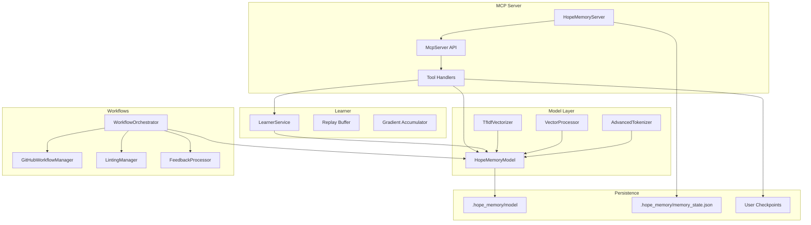

# Architecture Overview

This document captures the relationships between the MCP transport, HOPE memory model, learner service, and workflow utilities that make up the HOPE Memory server (state as of October 10, 2025).

## Topology

## MCP Transport & Lifecycle
- **Entry point:** `HopeMemoryServer` (`src/index.ts`) instantiates `McpServer` with `StdioServerTransport`.
- **Tool registration:** All MCP tools are bound inside the constructor, grouped into discovery, inference, training, persistence, and learner control.
- **Auto-initialization:** On first request, `autoInitialize()` loads or creates model and memory files beneath `memoryPath` (defaults to `~/.hope_memory`). After initialization the server schedules an auto-save loop (60 second cadence, retry-once with 5 second delay).
- **Shutdown:** Signal handlers flush memory state, dispose of TensorFlow resources, and tear down the learner loop.

## Model Stack
- **`HopeMemoryModel` (`src/hope_model/index.ts`):** Retentive network core with continuum memory levels, adaptive routing, and optimizer hooks. The top-level class surfaces the MCP-facing `forward`, `trainStep`, `storeMemory`, and persistence helpers.
- **Continuum Memory:** `ContinuumMemory` manages short-, long-, and archival tiers, promotion rules, pruning, and serialization of HOPE-specific fields (`archive`, `levelIndex`, `surpriseBuffer`).
- **Retentive Core & Filters:** `RetentiveCore` and `SelectiveStateSpace` (Mamba-inspired) provide linear-time sequence modeling with learned retention gates.
- **Routing & Surprise:** `MemoryRouter` produces sparse expert weights and surprise metrics that feed memory prioritisation and telemetry.
- **Optimizer Hooks:** `DeltaCompressionHook`, `LayerScheduler`, and `UpdateBuffer` enable efficient distributed training and incremental updates.

## Learner Loop
- **`LearnerService` (`src/learner.ts`):** Maintains a ring-buffer replay set, gradient accumulation, and configurable loss weighting (contrastive, next-token, MLM).
- **Tokenizer Injection:** `init_learner` installs a mock tokenizer (random tensors) unless you swap in `AdvancedTokenizer`. Replace `server.tokenizer` before calling learner tools for deterministic embeddings.
- **Control Surface:** Tools `init_learner`, `pause_learner`, `resume_learner`, `get_learner_stats`, and `add_training_sample` manage the learner state.

## Workflow Orchestration
- `WorkflowOrchestrator` wires memory-backed analytics into GitHub automation, linting enforcement, and feedback processing. It depends on `WorkflowConfig` feature flags (`src/types.ts`) and on `HopeMemoryModel.storeWorkflowMemory` hooks.
- `GitHubWorkflowManager`, `LintingManager`, and `FeedbackProcessor` (under `src/workflows/`) represent discrete workflow adapters. `WorkflowUtils` supplies shared helpers for credentials, retry policies, and telemetry scaffolding.
- These modules are currently **experimental**—they are not invoked from the MCP server and require productionization (secure credential storage, rate limiting, retries, centralized logging) before deployment. Decide in Phase 5 whether to integrate or archive.

## Persistence Contract
- **Model artifacts:** Saved to `memoryPath/model/` using TensorFlow.js format. Auto-init writes once to ensure subsequent runs can load without reinitializing weights.
- **Memory state:** Stored as JSON arrays of tensor data with shape metadata. `save_checkpoint`/`load_checkpoint` allow arbitrary paths within `memoryPath` or the current working directory (whitelisted by `validateFilePath`).
- **Checkpoints include:** flattened tensor values, shape tuples, model config, and timestamp—enabling safe reloads after restarts.

## Data Flows
1. **Tool Call:** MCP client invokes tool over stdio.
2. **Validation:** Zod schemas ensure parameter correctness; invalid inputs return textual error messages.
3. **Tensor Processing:** `VectorProcessor` and `HopeMemoryModel` convert inputs, manage memory state, and run inference/training.
4. **Persistence:** Memory updates are written to in-memory tensors, optionally flushed to disk via auto-save or explicit checkpoint.
5. **Learner Feedback:** When active, `LearnerService` polls the replay buffer on a fixed interval (`updateInterval`) and applies gradient updates back to the model.

## Related Documentation
- [docs/api/README.md](api/README.md) — detailed tool reference and schema defaults.
- [README.md](../README.md) — quick start, integration notes, and feature summary.
- [ROADMAP_ANALYSIS.md](../ROADMAP_ANALYSIS.md) — strategic roadmap and open gaps.
- [IMPLEMENTATION_COMPLETE.md](../IMPLEMENTATION_COMPLETE.md) — delivery checklist and next steps.
